# AI-Powered Enterprise Knowledge Assistant (RAG Framework)

<p align="center">
  <b>Unify knowledge. Amplify answers.</b>
</p>

# Architecture

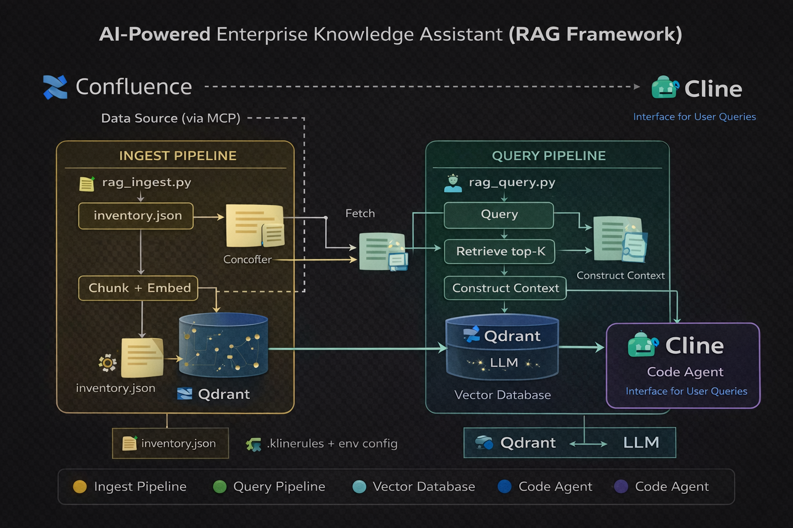

# Flow

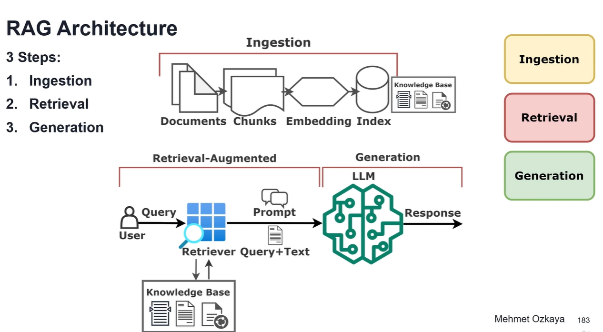


#  Core Flow:

```
Interface — Cline (VSCode) is the single entry/exit point for the user. Queries go in, cited answers come back.
Ingest pipeline (rag_ingest.py) — reads page links from inventory.json, fetches content via Confluence API, cleans/normalises it, applies semantic chunking, generates embeddings, and stores vectors + metadata into Qdrant.
Query pipeline (rag_query.py) — receives the user query, embeds it, performs semantic search against Qdrant (top-K + rerank), builds a context window, calls the LLM, and returns a structured answer with source citations back to Cline.
Storage — Qdrant as the vector store, and .clinerules + env config governing coding standards and API keys.
```

# ✅ Folder - RAG Framework

```
ai-powered-knowledge-assistant/
├── data-sources/
│   └── inventory.json          ← Enriched Confluence page registry
├── rag-framework/
│   ├── config.py               ← Central config (env vars, constants)
│   ├── confluence_loader.py    ← Fetch + clean Confluence pages via REST API
│   ├── chunker.py              ← Semantic paragraph-aware chunking
│   ├── embedder.py             ← Embedding generation (LiteLLM/OpenAI-compat)
│   ├── qdrant_store.py         ← Qdrant collection CRUD
│   ├── rag_ingest.py           ← Ingest pipeline orchestrator (manual run)
│   └── rag_query.py            ← Query pipeline orchestrator (Cline interface)
└── .clinerules                 ← Coding standards + RAG design rules
```

## RAG Ingest Pipeline

```text
$ python rag_ingest.py
```

## RAG Query Pipeline

```text
$ python rag_query.py "What is the AI?"
```


## RAG Pipelines Overview

### Ingestion

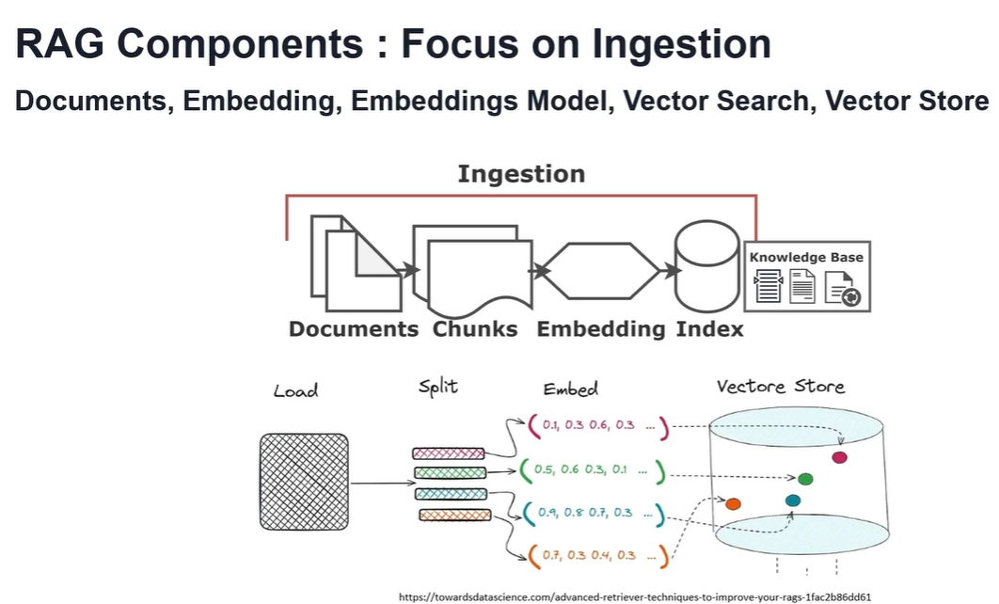

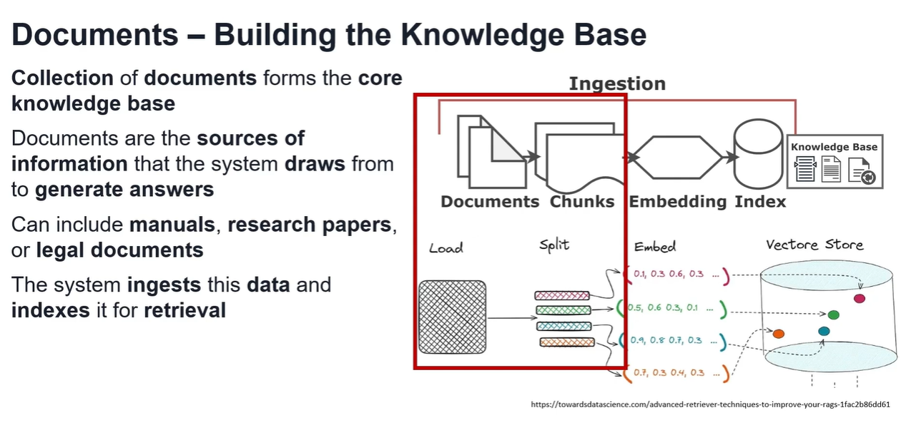

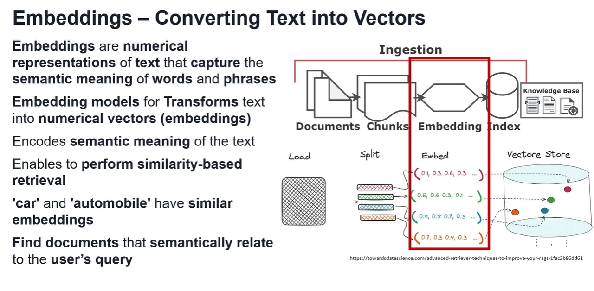

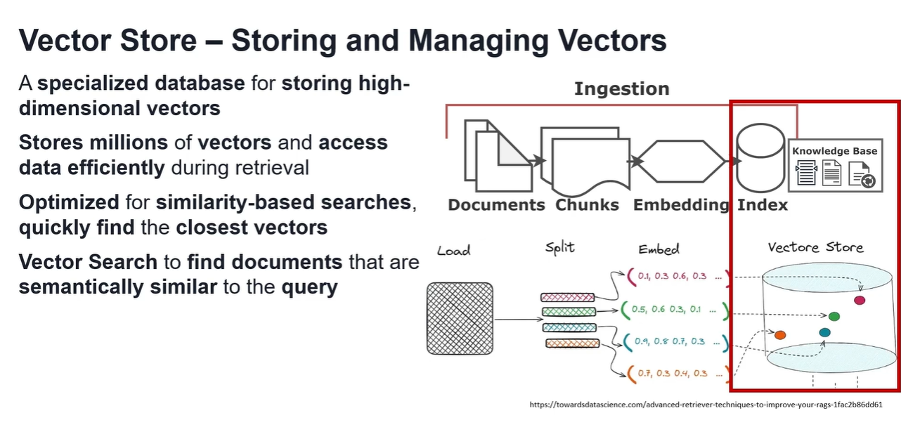

### Retrieval

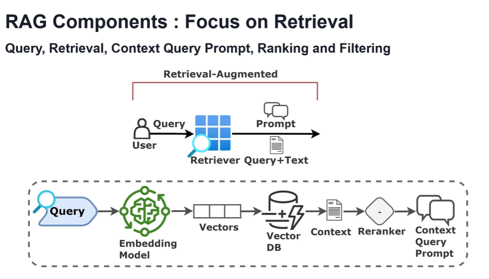

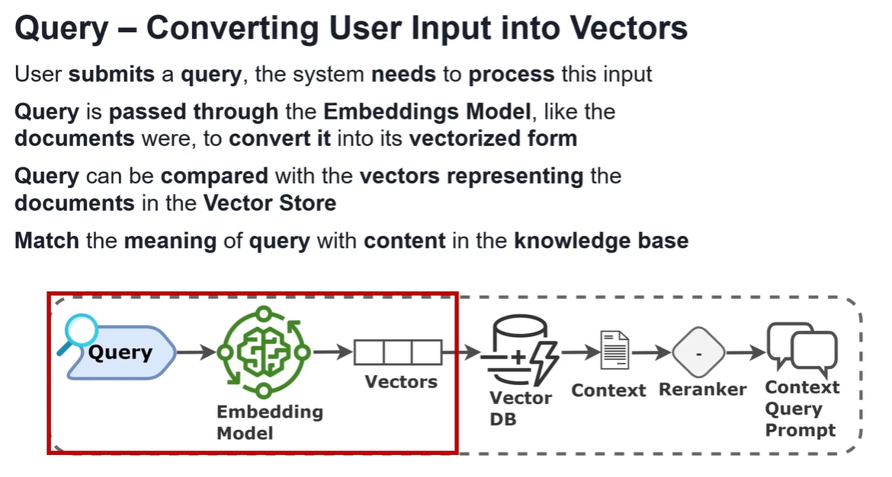

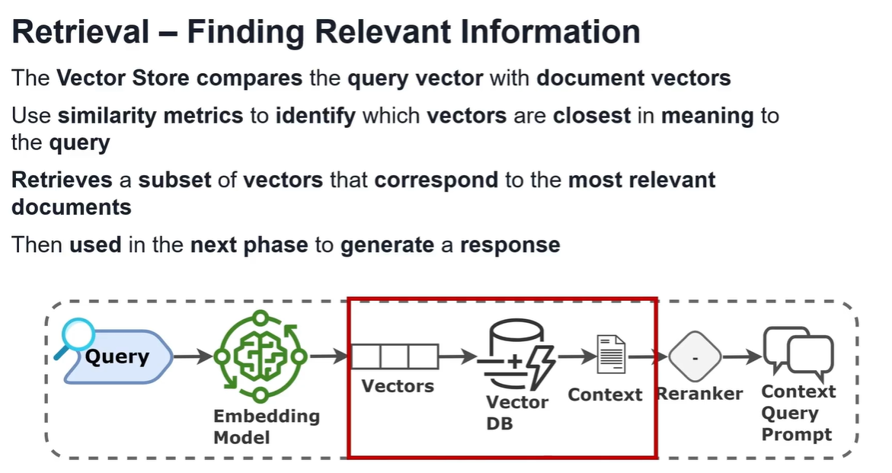

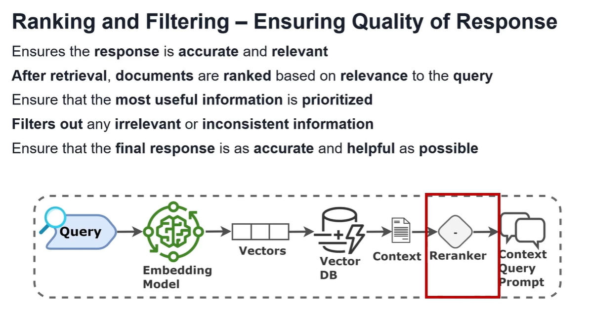

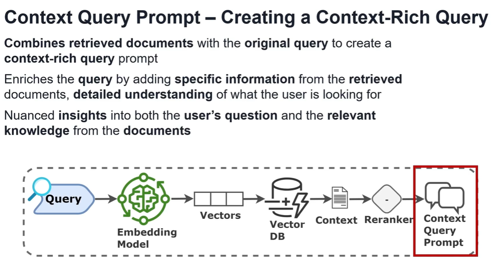


### Generation

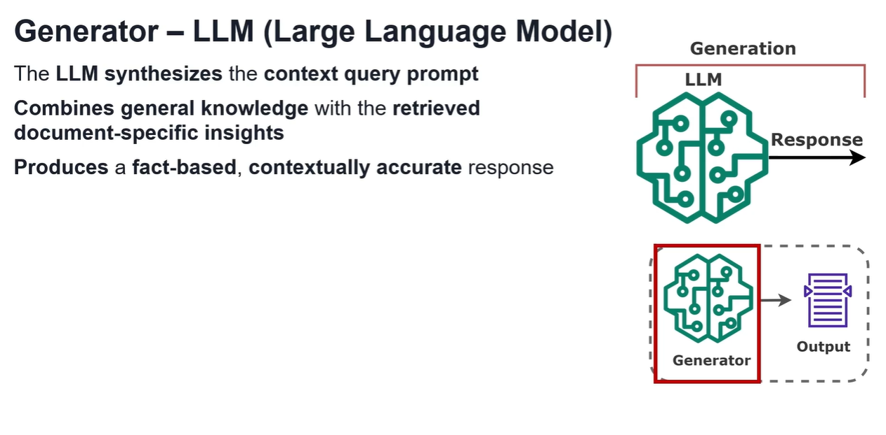

### E2E Workflow (RAG)

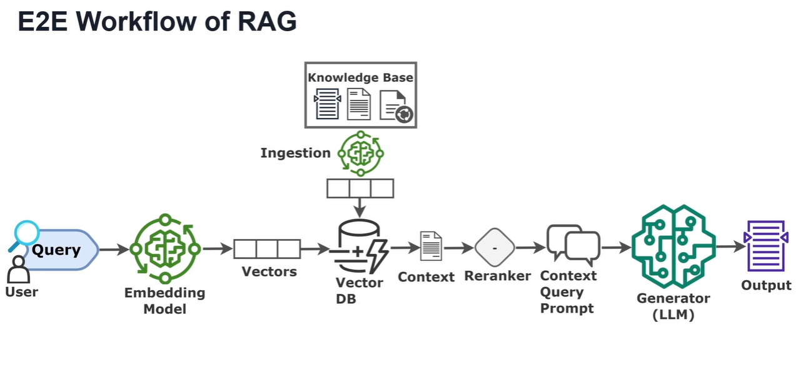

## 🤝 Let's Build Together

This is an AI-Powered Enterprise Knowledge Assistant (RAG Framework) for AI-native engineering. If you're exploring similar problems in RAG or agentic workflows, open an issue, fork it, or reach out — let's collaborate and build this together!

## 👤 Author

**Vishvendra Singh** — AI Engineer • Technology Leader • Innovation • Strategy • Governance • Observability • DevOps • SRE • Cloud • Open-Source Contributor

[LinkedIn](https://www.linkedin.com/in/vishvendrasingh1) · [GitHub](https://github.com/Vish-TechOps)